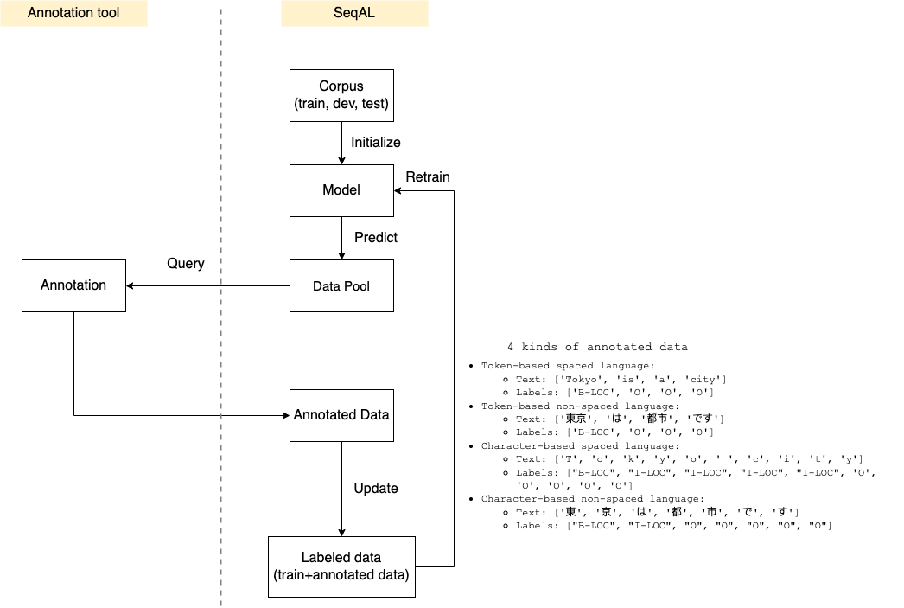

# Tutorial 7: Annotated Data

This tutorial shows how to receive the labeled data.



The annotated data could have 4 kinds of format. Next we will demonstrate how to process different annotated data.

## Token-based Annotated Data 

Token-based annotated data means one token has one label.

Example of spaced language:

```
[
    {
        "text": ['Tokyo', 'is', 'a', 'city'],
        "labels": ['B-LOC', 'O', 'O', 'O']
    }
]
```

Example of non-spaced language:
```
    [
        {
            "text": ['東京', 'は', '都市', 'です'],
            "labels": ['B-LOC', 'O', 'O', 'O']
        }
    ]
```

For such annotated data, we can use `Aligner.add_tags_on_token()` to process it.


```python
# 1~7

# initialize Aligner
aligner = Aligner()

# 8. iteration
for i in range(iterations):
    # 9. query unlabeled sentences
    queried_samples, unlabeled_sentences = learner.query(
        unlabeled_sentences, query_number, token_based=token_based, research_mode=False
    )

    # 10. annotate data
    annotated_data = human_annotate(queried_samples)

    # 11. retrain model with newly added queried_samples
    queried_samples = aligner.add_tags_on_token(annotated_data)
    learner.teach(queried_samples, dir_path=f"output/retrain_{i}")
```

In step 10, it receive the annotated data.

In step 11, `Aligner.add_tags_on_token()` convert annotated data to the format that could be added to training data.


The detail of spaced language and non-spaced language can be found in [TUTORIAL_2_Prepare_Corpus](TUTORIAL_2_Prepare_Corpus.md).

## Character-based Annotated Data

Token-based annotated data means one character has one label.

### Character-based Spaced Language

Example of character-based spaced language.

```
[
    {
        "text": ['T', 'o', 'k', 'y', 'o', ' ', 'c', 'i', 't', 'y'],
        "labels": ["B-LOC", "I-LOC", "I-LOC", "I-LOC", "I-LOC", 'O', 'O', 'O', 'O', 'O']
    },
]
```

For such annotated data, we can use `Aligner.add_tags_on_char_spaced_language()` to process it.


```python
# 1~7

# initialize Aligner
aligner = Aligner()

# 8. iteration
for i in range(iterations):
    # 9. query unlabeled sentences
    queried_samples, unlabeled_sentences = learner.query(
        unlabeled_sentences, query_number, token_based=token_based, research_mode=False
    )

    # 10. annotate data
    annotated_data = human_annotate(queried_samples)

    # 11. retrain model with newly added queried_samples
    queried_samples = aligner.add_tags_on_char_spaced_language(annotated_data, input_schema="BIO", output_schema="BIO", tag_type="ner")
    learner.teach(queried_samples, dir_path=f"output/retrain_{i}")
```

In step 11, `Aligner.add_tags_on_char_spaced_language()` convert annotated data to the format that could be added to training data.

The parameters:
- `annotated_data`: A list of labeled data.
- `input_schema`: The schema of input tags. It supports "BIO", "BILOU", "BIOES".
- `output_schema`: The schema of output tags. It supports "BIO", "BIOES". Because Flair only support "BIO" and "BIOES", we output these two kind of schema.
- `tag_type`: The tag type. It can be "ner", "pos" and so on.

### Character-based Non-spaced Language

Example of character-based non-spaced language.

```
[
    {
        "text": ['東', '京', 'は', '都', '市', 'で', 'す'],
        "labels": ["B-LOC", "I-LOC", "O", "O", "O", "O", "O"]
    }
]
```

For such annotated data, we can use `Aligner.add_tags_on_char_non_spaced_language()` to process it.


```python
# 1~7

# initialize Aligner
aligner = Aligner()
nlp = spacy.load("ja_core_news_sm")

# 8. iteration
for i in range(iterations):
    # 9. query unlabeled sentences
    queried_samples, unlabeled_sentences = learner.query(
        unlabeled_sentences, query_number, token_based=token_based, research_mode=False
    )

    # 10. annotate data
    annotated_data = human_annotate(queried_samples)

    # 11. retrain model with newly added queried_samples
    queried_samples = aligner.add_tags_on_char_non_spaced_language(annotated_data, input_schema="BIO", output_schema="BIO", tag_type="ner", spacy_model=nlp)

    learner.teach(queried_samples, dir_path=f"output/retrain_{i}")
```

Different from spaced language, we have to tokenize non-spaced language. For example, we tokenize `"ロンドンは都市です"` to `["ロンドン"は", "都市", "です"]`.

We should download the spacy model beforehand as the tokenizer. We can find different language's spacy model in [spacy models](https://spacy.io/models/en).


The parameters:
- `annotated_data`: A list of labeled data.
- `input_schema`: The schema of input tags. It supports "BIO", "BILOU", "BIOES".
- `output_schema`: The schema of output tags. It supports "BIO", "BIOES". Because Flair only support "BIO" and "BIOES", we output these two kind of schema.
- `tag_type`: The tag type. It can be "ner", "pos" and so on.
- `spacy_model`: The spacy language model.
