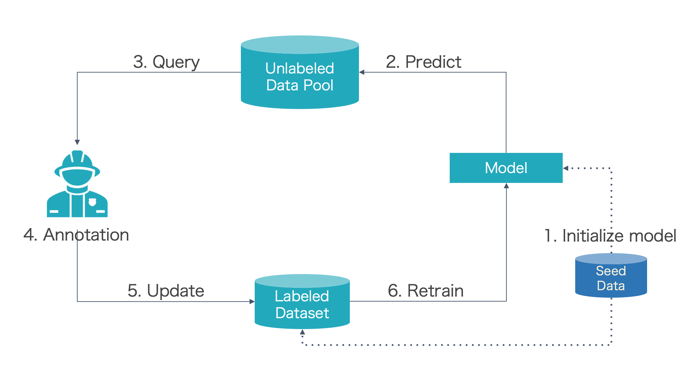

# Welcome to SeqAL

SeqAL is a sequence labeling active learning framework based on Flair.

Please follow the tutorial to know the usage of SeqAL.

## Active Learning Cycle

To understand what SeqAL can do, we first introduce the pool-based active learning cycle.



- Step 0: Prepare seed data (a small number of labeled data used for training)
- Step 1: Train the model with seed data
  - Step 2: Predict unlabeled data with the trained model
  - Step 3: Query informative samples based on predictions
  - Step 4: Annotator (Oracle) annotate the selected samples
  - Step 5: Input the new labeled samples to labeled dataset
  - Step 6: Retrain model
- Repeat step2~step6 until the f1 score of the model beyond the threshold or annotation budget is no left

## Simulation of Active Learning Cycle

Run below script can run the active learning cycle. Because there is no 3rd part annotation tool, we just simulate the active learning cycle. 

```python
from flair.embeddings import WordEmbeddings

from seqal.active_learner import ActiveLearner
from seqal.datasets import ColumnCorpus, ColumnDataset
from seqal.samplers import LeastConfidenceSampler

# 1. get the corpus
columns = {0: "text", 1: "ner"}
data_folder = "./data/sample_bio"
corpus = ColumnCorpus(
    data_folder,
    columns,
    train_file="train_seed.txt",
    dev_file="dev.txt",
    test_file="test.txt",
)

# 2. tagger params
tagger_params = {}
tagger_params["tag_type"] = "ner"
tagger_params["hidden_size"] = 256
embeddings = WordEmbeddings("glove")
tagger_params["embeddings"] = embeddings
tagger_params["use_rnn"] = False

# 3. trainer params
trainer_params = {}
trainer_params["max_epochs"] = 1
trainer_params["mini_batch_size"] = 32
trainer_params["learning_rate"] = 0.1
trainer_params["patience"] = 5

# 4. setup active learner
sampler = LeastConfidenceSampler()
learner = ActiveLearner(corpus, sampler, tagger_params, trainer_params)

# 5. initialize active learner
learner.initialize(dir_path="output/init_train")

# 6. prepare data pool
pool_file = data_folder + "/labeled_data_pool.txt"
data_pool = ColumnDataset(pool_file, columns)
unlabeled_sentences = data_pool.sentences

# 7. query setup
query_number = 2
token_based = False
iterations = 5

# 8. iteration
for i in range(iterations):
    # 9. query unlabeled sentences
    queried_samples, unlabeled_sentences = learner.query(
        unlabeled_sentences, query_number, token_based=token_based, research_mode=True
    )

    # 10. retrain model, the queried_samples will be added to corpus.train
    learner.teach(queried_samples, dir_path=f"output/retrain_{i}")
```

When calling `learner.query()`, we set `research_mode=True`. This means that we simulate the active learning cycle. We prepare above code in the `examples` directory. If you clone SeqAL to your local machine, you should move to the root directory and run below command in terminal.

```
python examples/active_learning_cycle_research_mode.py
```

We also provide a notebook to demonstrate the simulation: [active_learning_cycle_research_mode](../notebooks/active_learning_cycle_research_mode.ipynb)

More detail about research (simulation) mode can be found in [Research and Annotation Mode](./TUTORIAL_5_Research_and_Annotation_Mode.md).


## Real Case of Active Learning Cycle Implementation

In the real situation, SeqAL should connect to an annotation tool. Below code is a demonstration to show how SeqAL connect with other annotations tools. 

```python
from flair.embeddings import WordEmbeddings

from seqal.active_learner import ActiveLearner
from seqal.datasets import ColumnCorpus
from seqal.samplers import LeastConfidenceSampler
from seqal.utils import load_plain_text
from seqal.aligner import Aligner
from xxxx import annotate_by_human  # User need to prepare this method to interact with annotation tool


# 0: prepare seed data, validation data, test data, and unlabeled data pool
# - labeled data:
#     - seed data: `train_seed.txt`
#     - validation data: `dev.txt`
#     - test data: `test.txt`
# - unlabeled data:
#     - unlabeled data pool: `unlabeled_data_pool.txt`

# 1. get the corpus
columns = {0: "text", 1: "ner"}
data_folder = "./data/sample_bio"
corpus = ColumnCorpus(
    data_folder,
    columns,
    train_file="train_seed.txt",
    dev_file="dev.txt",
    test_file="test.txt",
)

# 2. tagger params
tagger_params = {}
tagger_params["tag_type"] = "ner"  # what tag do we want to predict?
tagger_params["hidden_size"] = 256
embeddings = WordEmbeddings("glove")
tagger_params["embeddings"] = embeddings

# 3. Trainer params
trainer_params = {}
trainer_params["max_epochs"] = 1
trainer_params["mini_batch_size"] = 32
trainer_params["learning_rate"] = 0.1
trainer_params["train_with_dev"] = True

# 4. initialize learner
sampler = LeastConfidenceSampler()
learner = ActiveLearner(corpus, sampler, tagger_params, trainer_params)

# 5. initial training
learner.initialize(dir_path="output/init_train")

# 6. prepare unlabeled data pool
file_path = "./data/sample_bio/unlabeled_data_pool.txt"
unlabeled_sentences = load_plain_text(file_path)

# 7. query setup
query_number = 2
token_based = False
iterations = 5

# initialize the tool to read annotated data
aligner = Aligner()

# 8. iteration
for i in range(iterations):
    # 9. query unlabeled sentences
    queried_samples, unlabeled_sentences = learner.query(
        unlabeled_sentences, query_number, token_based=token_based, research_mode=False
    )

    # 10. convert sentence to plain text
    queried_texts = [{"text": sent.to_plain_string()} for sent in queried_samples]
    # queried_texts:
    # [
    #   {
    #     "text": "I love Berlin"
    #   },
    #   {
    #     "text": "Tokyo is a city"
    #   }
    # ]

    # 11. send queried_texts to annotation tool
    # annotator annotate the queried samples
    # 'annotate_by_human' method should be provide by user
    annotated_data = annotate_by_human(queried_texts)
    # annotated_data:
    # [
    #     {
    #         "text": ['I', 'love', 'Berlin'],
    #         "labels": ['O', 'O', 'B-LOC']
    #     }
    #     {
    #         "text": ['Tokyo', 'is', 'a', 'city'],
    #         "labels": ['B-LOC', 'O', 'O', 'O']
    #     }
    # ]

    # 12. convert data to sentence
    queried_samples = aligner.align_spaced_language(annotated_data)

    # 13. retrain model, the queried_samples will be added to corpus.train
    learner.teach(queried_samples, dir_path=f"output/retrain_{i}")
```


First, we should provide the 4 files to SeqAL. The 3 labeled datasets (seed data, valid data, test data) and 1 unlabeled dataset (data pool). If you want to use the [existing dataset](https://github.com/flairNLP/flair/blob/master/resources/docs/TUTORIAL_6_CORPUS.md) included in Flair, you can follow the [data_preparation](../notebooks/data_preparation.ipynb) notebook. Then you only need to provide the unlabeled dataset.

If the annotation tool if the only interface that the user can interactive, the annotation tool should transfer the 4 files to SeqAL.

We provide the script in `examples/active_learning_cycle_annotation_mode.py` and the notebook to explain in detail: [active_learning_cycle_annotation_mode](../notebooks/active_learning_cycle_annotation_mode.ipynb)
