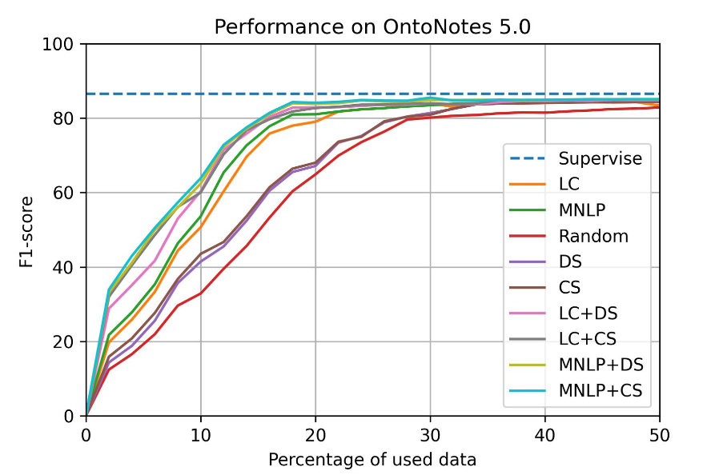
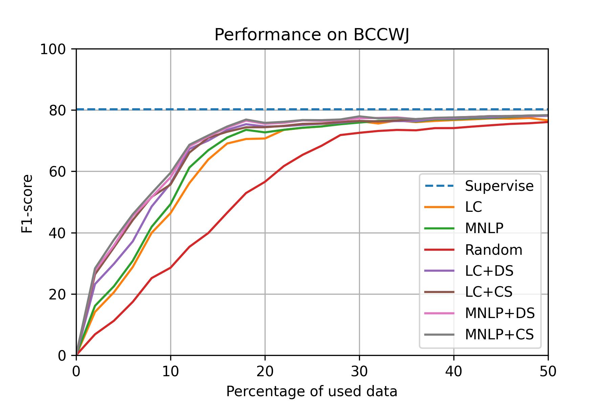
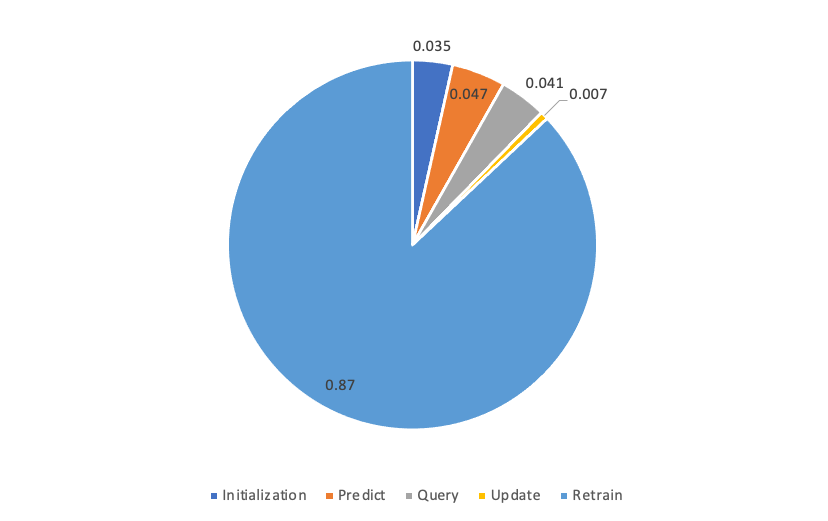
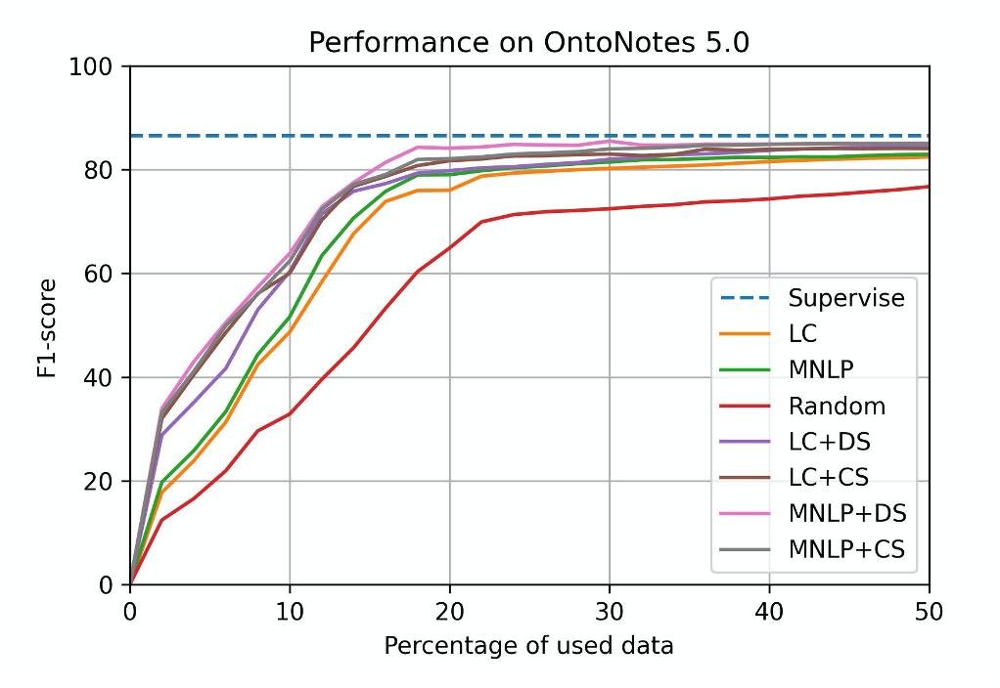
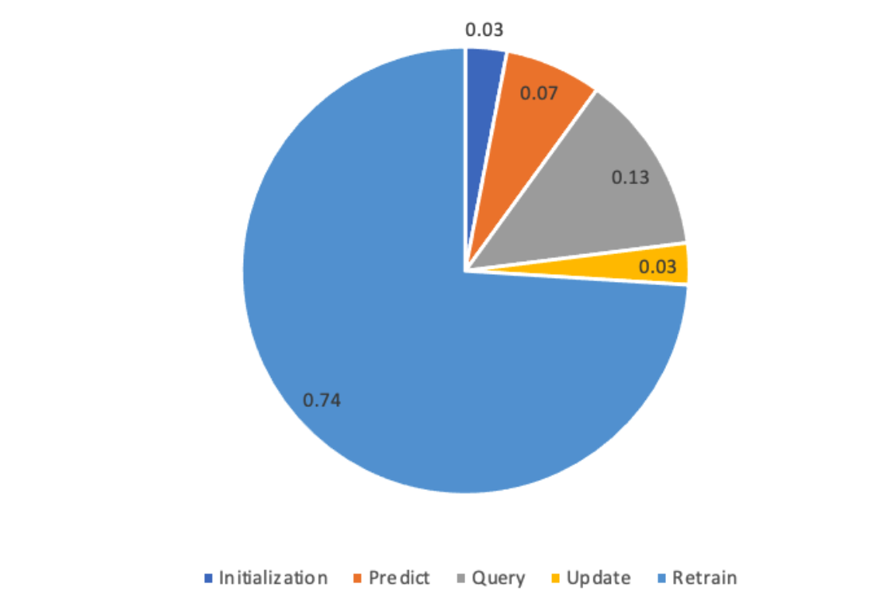

# SeqAL Performance on Metrics and Time Cost

## Performance

We will show the performance of SeqAL on different datasets with different language.

- **Supervise** means that training model on full data
- **LC** (Least confidence) and **MNLP** (Maximum Normalized Log-Probability) are query algorithm with different calculation on informativeness. 
- **Random** means randomly query data without caring about informativeness.
- **CS** (Clustering Similarity) and **DS** (Distributed Similarity) are the diversity based sampling methods for NER

We first train the model on seed data (2% of training data). Then we query 2％ of training data in each iteration untill 50% data are queried.

### SeqAL on different languages

**Ontonotes 5.0 (EN)**

Setup:
- dataset: CoNLL 2003(English)
- model: Bi-LSTM CRF
- total query data: 50%
- epochs: 20
- batch_size: 32
- learning_rate: 0.015
- embeddings: bert-base-uncased
- GPU: AWS p3.8xlarge

**BCCWJ (JP)**

Setup:
- dataset: BCCWJ
- model: Bi-LSTM CRF
- total query data: 50%
- epochs: 20
- batch_size: 32
- learning_rate: 0.015
- embeddings: bert-base-japanese 
- GPU: AWS p3.8xlarge

**People's Daily 2014 (CN)**

Setup:
- dataset: People's Daily 2014
- model: Bi-LSTM CRF
- total query data: 50%
- epochs: 20
- batch_size: 32
- learning_rate: 0.015
- embeddings: bert-base-chinese 
- GPU: AWS ml.p3.8xlarge

### SeqAL on different domain

**Ritter (SNS)**

Setup:
- dataset: Ritter
- model: Bi-LSTM CRF
- total query data: 50%
- epochs: 20
- batch_size: 32
- learning_rate: 0.015
- embeddings: bert-base-japanese 
- GPU: AWS g4dn.2xlarge

### Conclusion

According to the performance of different sampling methods, `MNLP` is a proper baseline method. If we want to achieve high perforamnce, we recommend `MNLP+DS`.

## Time cost

According to the [active learning cycle](./images/al_cycle.png), we run experiments to check the time cost in each step.

### GPU model time cost in each step.

The GPU model is Bi-LSTM CRF model. Below is the experiment setup.

| Setup                    | Value                                          |
| ------------------------ | ---------------------------------------------- |
| Dataset                  | Ontonotes 5.0                                  |
| Model                    | Bi-LSTM CRF                                    |
| Total query data         | 50%                                            |
| Iterations               | 25                                             |
| Epochs in each iteration | 20                                             |
| Batchsize                | 32                                             |
| Learning rate            | 0.015                                          |
| Embeddings               | bert-base-uncased                              |
| AWS machine                      |      AWS g4dn.2xlarge (0.752 USD/hour)                                 |
| GPU                      | NVIDIA T4                                      |
| CPU                      | Intel(R) Xeon(R) Platinum 8259CL CPU @ 2.50GHz |

Below is the percentage in each step.

Below is the absolute value of time cost in each step.

Below is the GPU model performance.

### CPU model time cost in each step.

The CPU model is CRF model. Below is the experiment setup.

| Setup                    | Value                                          |
| ------------------------ | ---------------------------------------------- |
| Dataset                  | Ontonotes 5.0                                  |
| Model                    | CRF                                    |
| Total query data         | 50%                                            |
| Iterations               | 25                                             |
| Epochs in each iteration | 20                                             |
| Batchsize                | 32                                             |
| Learning rate            | 0.015                                          |
| Embeddings               | bert-base-uncased                              |
| AWS machine                      |      AWS c5.2xlarge (0.34 USD/hour)                                 |
| CPU                      | Intel(R) Xeon(R) Platinum 8275CL CPU @ 3.00GHz |

Below is the percentage in each step.

Below is the absolute value of time cost in each step.

Below is the CPU model performance.

### Conclusion

Compare with the time cost and perforamnce on GPU model and CPU model, we recommend use the CPU model. Because CPU model can decrease the time cost greatly only sacrificing a little performance. Another reason is that CPU model is cheaper than GPU mode. The price of CPU machine is about half price of GPU machine.
