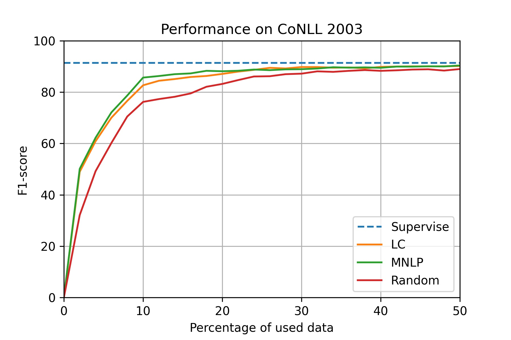

# Performance

**Setup**

- Setup:
  - dataset: CoNLL 2003(English)
  - model: Bi-LSTM CRF
  - total query data: 50%
  - batch_size: 32
  - learning_rate: 0.015
  - embeddings: glove.100d
  - GPU: AWS ml.p3.8xlarge

- Each iteration:
  - query 2％ of data
  - 25 epoches

Each iteration means run step2~step6 one time.

### F1 score

- **Supervise** means that training model on full data, and the f1 score is 91.38
- **LC** (Least confidence) and **MNLP** (Maximum Normalized Log-Probability) are query algorithm with different calculation on informativeness. 
- **Random** means randomly query data without caring about informativeness.

From the figure, we see that SeqAL can decrease the amount of training data. For example, when we use the **MNLP** sampling method, we only use 30% of data to achieve 88.57 f1 score, which is the 97% of the performance on **Supervise**. 

We also can know sampling methods have big impact on the final scores. For example, when we use 10% of data, **Random** achieves 76.2, **LC** achieves 82.67, and **MNLP** achieves 85.67.

### Time cost

With GPU:
- Each epoch: about 8s~40s
- Each iteration: about 5min~10min
- Total training time: about 6hr

When iteration increase, the number of training data will increase too. This increases the training time finally. We can use the GPU with big memory or increase the batch size to decrease the training time in each iteration.